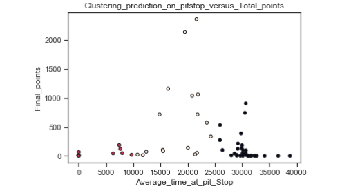
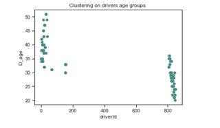
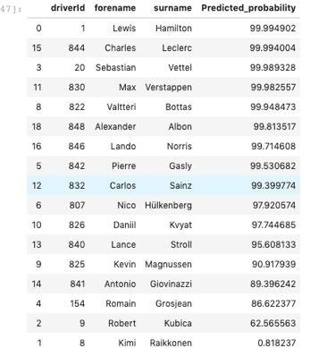
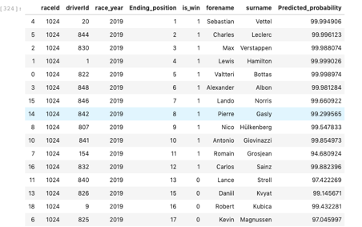
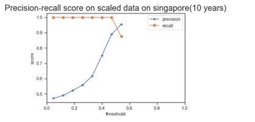

Author: 

Date of completion: MArch 30,2020

This project was my capstone project from the Data Science Diploma Program I completed at BrainStation in Vancouver. I have attached my jupyter notebooks which show all the detail in my work. The following text explains my overall approach and findings of this project.

Topic: Predictive Modelling of Singapore Grand Prix race

Problem Space:
-----------------------------------------------------------------------------------------------

The Marina Bay Street Circuit, also known as the “Singapore Street Circuit” is a street circuit around Singapore’s Marina Bay, which has been hosting the Singapore Grand Prix every year since 2008. Due to Singapore’s yearly high temperatures, its humidity, and the uneven nature of the street track and the heavy braking zones, the Singapore Circuit represents a physical challenge for both the drivers and cars and it is probably the most demanding race on the F1 calendar. Moreover, it is the longest race of Formula One Grand Prix season, taking up to two hours to complete.

Approach to the problem:
------------------------------------------------------------------------------------------------

There were 70 seasons(years)in formula one race. Each season hosts 22 races. Each of the races has 20 to 22 drivers and 10 constructors. Annual running cost to host F1 race is $ 58 M and construction cost for running F1 race is $ 280 M.
There are websites that provide cost information and ratings information about the Formula one series. But most of the blogs are giving information about analytics behind the race and didn't give machine learning approach to the data.

When I searched for publicly available Formula one datasets, I immediately realized that no dataset has labels drivers winning probability and race characetistics impact on the drivers winning. For that reason, I had to engineer the data set with  driver qualities and race qualities.They are as follows:

1.Life time winning,winning percentage,racing experience
2.practice time,pit stop time
3.Singapore weather

Due to a lack of a target variable (ie. drivers labeled as win or not), this problem was addressed using unsupervised learning, explained in more detail later. I have divided the project into 3 parts.

Part-1:

The objective of this part of this project is to find the potential drivers for the upcoming Singapore F1 race.
        
Key Technologies Used:

Tableau (Visualization software)

Scikit python

Flask python

Visual Code

Workflow pipeline:

1. Deployed a web scraper to gather practice time (Singapore race) from the official F1 auto-sport website. ( https://www.formula1.com/)

2. Data pre-processing

a)	Data cleaning
b)	Exploratory Data Analysis
c)	Weather API
d)	Feature Engineering

3. Machine learning Logistic Regression model (Best suited for my binary classification problem)

4. Tested with different machine learning algorithms and compared the performance.

Background
---------------------------------------------------------------------------------------------
Getting inspired by watching Netflix F1 documentary movies with my son, I decided to start my journey to do my data analysis and predictive modeling for the upcoming F1 race in Singapore. This will cover the challenges faced during data analysis, learning outcomes from the project, and the results from the machine learning models and predictions. The project started with 6 sections — data mining, data processing and exploration, feature engineering, model building, the final results, and the visualizations. It leads us to questions such as which strategy works well for the fastest driver for every circuits since every circuit has different characteristics like altitude, weather, turns, and curves in the circuits. Every driver has to undergo practice season before their qualifying season. Every final race starting grid depends on their qualifying season position. It is most likely that the starting pole position is highly demanding to secure a podium position.

Part1: 

1. Driver standings for only the Singapore race all through the 10 years.
2. Constructor standings for Singapore race all through the 10 years.
3. Results for Singapore races all through the 10 years
4. Qualifying season time for Singapore races all through the 10 years
5. Average pit stop time for Singapore races all through the 10 years

Part-2:

1. Writing a web scraping script for weather data from postman API
2. Writing a web scraping script for practice session time in Singapore race 2019

Part-3:

Merging the information appropriately without losing any vital characteristics of the race.

Final data frame would look like as follows:

Since there were 10 years of Singapore Grand Prix data, and each race has ~20 drivers each, which gives me 200 rows. As we know, machine learning models work well with large data sets, which goes minimally to around 1000 k rows/observation. I supplemented my data sets with weather data, practice time. This would help us to do more feature engineering rather than an increase in data points suitable for more machine learning models. I have started my analysis with simple machine learning algorithms such as logistic regression, decision trees, K-nearest neighbors, which handles small datasets.

Feature Engineering
--------------------------------------------------------------------------------------------

The primary consideration here for feature engineering is the values for missing qualification 1, qualification 2, and qualification 3 timings. The way qualification stages in Formula One work is that everyone will be racing for the fastest lap in each stage, and the slowest few will be cut off from the next stage. This session will determine the running order at the beginning of the race. This is often called setting the grid. The qualifying session is split into three parts, called Q1, Q2, and Q3. Q1 is 20 minutes long, followed by a seven-minute break. Q2 is 15 minutes long, followed by an eight-minute break. Q3 is 10 minutes long. During each part of qualifying, the fastest lap time set by a car is recorded. Drivers may run as many or as few laps as they wish.
After Q1 is complete, the eight slowest cars are eliminated (removed from) the qualifying session. This would include any cars that did not set a qualifying time. The remaining 18 car advance (move on to) Q2. The eight cars eliminated are placed in the last eight start positions, based on their fastest time from Q1. The procedure is repeated for Q2. The eight slowest cars from Q2 are placed in the 11 through 18 starting positions on the grid.

The top ten cars remain for Q3. After this final part of qualifying, the top ten starting positions on the grid are set. The fastest qualifier is placed in the first position, which is known as the pole position. This car will have an advantage at the start because they do not need to follow any other cars.

Q3 will then be left with 10 of the 20 drivers, and they will be racing for pole position. Hence, there will be missing values for Q2 and Q3 timings. The issue now is how to deal with them. I copied the Q2 round position holders’ timings to the Q3 column before copying Q1 round last 7 position drivers timings.

Machine Learning Model building

Finally, we had our data ready to feed into the model. My total dataset will be split into 2 parts, training set and testing set. 80% will be kept and trained on, to help with hyper-parameter of the top few machine learning models that perform well on this current dataset. 20% will then be kept for the testing phase, which will help me decide on the final model to use. I decided to test the model with 2019 Singapore race details. I compared the actual winning to predicted winning percentage. The best performing ML algorithms for the regression problem are tree-based algorithms, such as xgboost, and gradient boosted machines. This is expected given the small dataset we have. Gradient boosting seems to work much better. However, overfitting happened. Best algorithms for classification seem to be generative parametric models such as Gaussian Naive Bayes and plain old logistic regression due to the small dataset. However, the classification algorithm is best suited that the output will be probabilities, and thus give us a level of confidence in our predictions. Simple models are preferred in this case over complex ones like neural networks or support vector machines, given the small data set.

Results

However, the logistic regression shows the predicted probability of the drivers to get the level of confidence.

Conclusion: 

As shown in the above model prediction, Lewis Hamilton, Max Verstappen, has a 100 % probability of winning in the 2019 Singapore race, whereas Nico, Pierre have 99 % to win in the 2019 Singapore race. Antonio has a 95 % probability of winning. We can repeat this exercise for upcoming races to predict the winning probabilities for future races. COVID-19 has postponed all the future F1 races indefinitely as of now. Let us wait and see whether the predicted results come true.

Challenges:

1.	Data points are race-specific, not cumulative over the years.
2.	Weather Data collection is very challenging over the years over the different races across 35 years
3.	Practice season time has been collected for only one year, and Singapore race makes the Singapore race prediction modeling overfitting. (20 rows of information)

Future extension:

1. Implementing all the practice times, and compare final time with practice time, qualifying season time to find more insights. This will improve model training to achieve better test accuracy results.

2. Driver statistics such as Total lifetime points, lifetime winning, winning percentage, total races participated makes the model overfitting when the currently active drivers are filtered for the predictive modeling. Naive base algorithm will be tested with more driver-specific parameters.

3. Hypothesis will be derived for more analysis. Ex: Overtaking in the race affects the race points.

Part-2:

Data Analysis of Singapore Grand Prix race

Problem Space:

The objective of this part is to form the hypothesis about the racers' performance with different attributes of the race, analyze the data to prove it, or reject it based on the nature of the data. This part also finds different clusters in driver points, starting grids and average time spent at pit stops.

Key Technologies Used:

Scikit python

Data Analysis: Singapore season 2019

The following figure shows age distribution in Singapore season 2019. The average age of racers is 35.

Age Distribution in Singapore race

Figure-8 drivers age in Singapore race

Driver points versus constructor points distribution in Singapore race 

Figure-9  Driver points versus constructor points distribution in Singapore race in Singapore race

Findings:

Constructor points are distributed in the range of 1200 to 3000; however, driver points are distributed between 500 to 1500.

Clustering between driver_id, starting grid in Singapore race

Figure-10 Clustering between driver_id, starting grid in Singapore race

Findings:

The average starting grid over 10 years is a vital parameter,was calculated. There were three different clusters. The mean starting grid for the drivers whose id is 1 to 150 were able to start less than 10 position. Drivers whose id s were in the range of 800 were able to start mostly from 12 to 20 position.

Q: Who is the leading racer in Singapore season?

Bar graph on driver points across years in Singapore race

Figure-11 driver points across years in Singapore race

Findings:

Top 5 drivers in Singapore season:
1.	Lewis
2.	Sebastian
3.	Nico
4.	Fernando
5.	Kimi

Clustering between drivers and their points 

Figure-12 Clustering between drivers and their points

Findings:

Drivers whose ids are 100 are scored high. Drivers whose id are in the range of 800 scores are moderate.

Clustering between starting grid and points 

Figure-13 Clustering between starting grid and points

Findings:

The drivers who have started in less than 10 grids were able to score high.

Clustering between total time at pit stop versus total_points

Figure-14 Clustering between total time at pit stop versus total_points

Findings:

Drivers who stopped on an average of less than 25000(0.41 minute) milliseconds were able to reach the ending position faster and secure high points.

K means clustering prediction. 

Figure-15 K-means Clustering between 

Findings:

There are 3 clusters.
Drivers who stopped less than 10000 ms, likely to have a lower score.
Drivers who stopped in between 11000ms to 25000 ms are likely to score high points.
Divers who stopped in between 26000 ns to 30000 ms are likely to score up to moderate points.

Gaussian Model clustering

Figure-16 Gaussian Clustering between pit_Stops versus points

Findings:

There are 2 clusters.
Drivers who stopped less than 15000 ms are more likely to have a lower score.
Drivers who stopped in between 15000ms to 30000 ms can score high points.

Clustering on drivers age in Singapore race

Figure-17 Clusters in drivers age in Singapore race

Findings:

There are 2 clusters.

1.	Drivers whose age is between 35 to 50
2.	Drivers whose age is between 20 to 35

Clustering between starting grid versus ending grid

Figure-18 Clusters in drivers starting grids in Singapore race

Findings:

There are no clusters. Drivers who start at different starting grid were able to reach the ending position. However, it leads us to the question of " how the overtaking of drivers in the race affects the ending position". This question will be answered in subsequent sections.

Practice time distribution in Singapore season

Figure-19 Practice time distribution in Singapore season

Findings:

Across the 3 different practice sessions, the second practice session seems to faster and easier than the first and third practice session.

Machine Learning Model Results:

Machine learning prediction without "Ending position"

Figure-20 Model performance

Findings:

Looking at the different models, Logistic, Gaussian, RF classifier, and decision tree is giving more accuracy than the Support Vector Machine and K Nearest Neighbours.

Predicted winning probability with driver names for 2019 with the training set (2008 to 2018)

Figure-21 Predicted Model performance

Findings:

Looking at the 3 different winning probability range, Lewis, Sabastian, Max, and other racers has high (99.99%) of winning probability in 2019 Singapore race. Antonio, Romain, Robert has less likely to win in the 2019 Singapore race. Let us see in the following sections how far my predictions are accurate!

Predicted probability versus actual Singapore season 2019 results

Figure-22 Predicted results versus actual results.

Findings:

Looking at the different winning probability range, Lewis, Sabastian, Max, and other racers have high (99.99%) of winning probability in 2019 Singapore race, and it is true when we see the actual 2019 results in "Ending position" column. But, my model some false positives in the bottom 4 racers. Why? Some of the independent variable are skewed and affects the predictive power of the model. Let me analyze and come back with more accuracy!

All Singapore season (2008 to 2019)

Un-Scaled data reports:

Precision score (All races in Singapore season)
95.6
Recall score (All races in Singapore season)
91.66
F1 score (All races in Singapore season)
93.61

Scaled data reports:

Precision score (All races in Singapore season)
95.6
Recall score (All races in Singapore season)
91.66
F1 score (All races in Singapore season)
93.61

Figure-23 Predicted results for several years Singapore season.

Findings:

Looking at the different predicted winning probability in different years, Fernando has a 92 % winning probability in 2017 than 2016, which is 33 %.

Precision and recall graph on scaled data

Figure-24 Precision score versus recall score for various years Singapore season

Findings:

The precision score is gradually increasing from 0.5, and it converges in 0.9. The precision score shows the model performance. High precision score shows the model accuracy. The current precision score is 95.6 %.

Conclusion: 

This part of my research has mostly covered Singapore race 2019 race characteristics and Clustering. Moreover, the predictive power of the model was analyzed. The next part of my research covers the following hypothesis:

1. Top 10 races ranked and given rating score out of 10, based on count of DNF count on each race.
2. The number of over takings in the race affects the final rating.
3. Race evolution among the top 5 drivers across different races affects the rating of the race.
4. The drivers' rank and position affect the rating of the race. 
